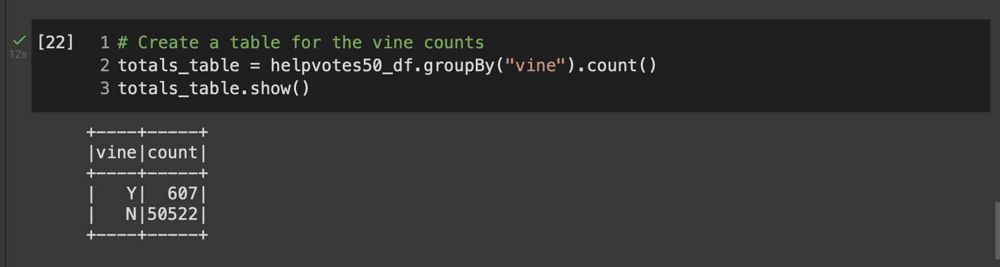
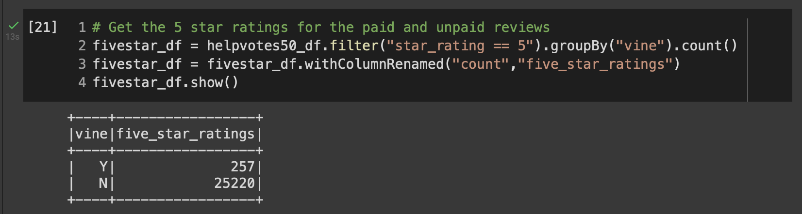
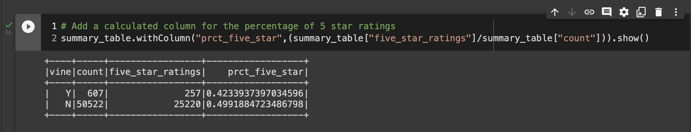
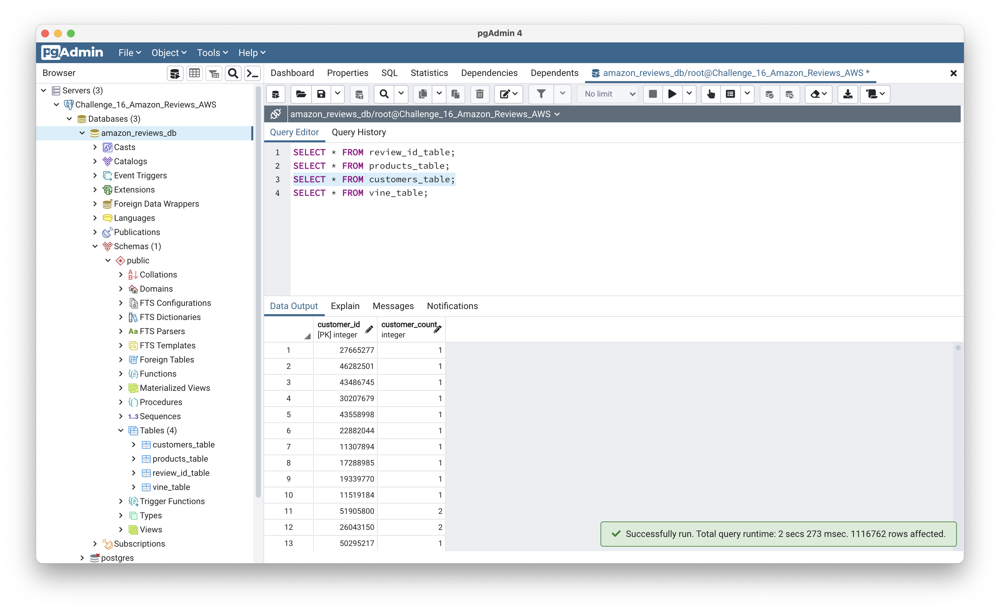
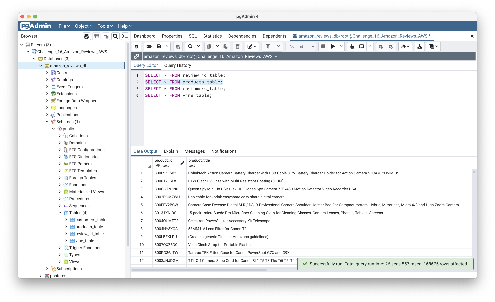
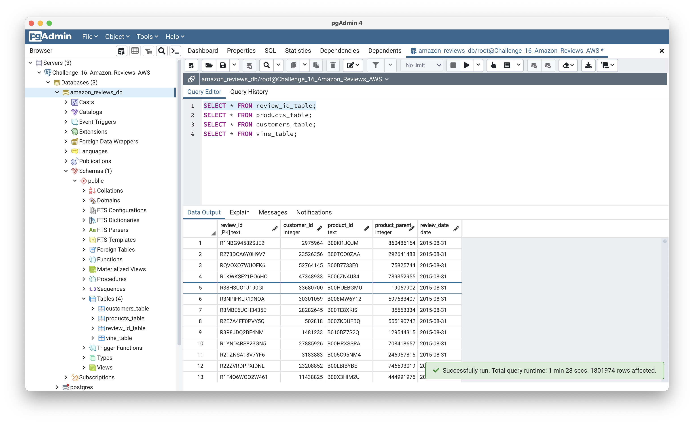
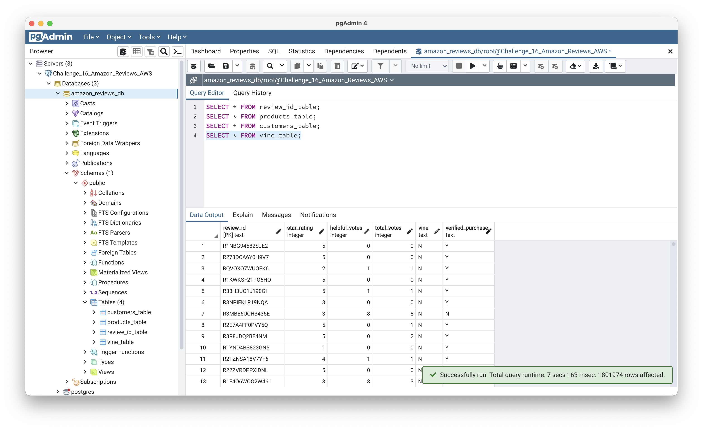

# Amazon Vine Analysis
Module 16 repository

## Overview

The purpose of this project is to analyze Amazon reviews written by members of the paid Amazon Vine program. The Amazon Vine program is a service that allows manufacturers and publishers to receive reviews for their products. Companies pay a small fee to Amazon and provide products to Amazon Vine members, who are then required to publish a review.

Amazon provides approximately 50 review datasets organized by product families. Each one contains reviews of a specific product, from clothing apparel to wireless products. 

The project selects one of these review datasets and transforms the data in order to establish if the vine reviews show any bias versus the non-paid reviews.

### Methodology

Our analysis was conducted utilizing a *PySpark* notebook in *Google Colab*. The notebook *.ipynb* file is included in this repository as *Vine_Reviews_Analysis.ipynb*.

The code launches a *Spark Session* to read the Amazon reviews for the camera category from an Amazon AWS S3 bucket, available at the url *https://s3.amazonaws.com/amazon-reviews-pds/tsv/amazon_reviews_us_Camera_v1_00.tsv.gz*. 

This database contained a total of 1,801,974 reviews. The data was converted to a dataframe, and then various filters were applied to obtain our results. These filters included first selecting a subset of the data with total count of reviews greater than or equal to 20. Then, this subset was filtered to account for customer feedback, were the helpful votes were at least 50% of the total votes. Next, we grouped the data by paid vine reviews, versus non-paid reviews. Finally, we created a data table to report the percentage of 5 star reviews to total reviews for each of the two groups, the paid vine and the un-paid reviews. To determine bias, we compared the relative percentages.

## Results

After running our code, we are able to address the following key metrics:

* *How many Vine reviews and non-Vine reviews were there?*

Of reviews with a minimum of 20 total votes, where at least 50% of the votes were helpful, Vine reviews accounted a total of 607. Non-Vine reviews accounted a total of 50,522.

* *How many Vine reviews were 5 stars? How many non-Vine reviews were 5 stars?*

Of these, 257 Vine reviews were 5-star while 25,220 non-Vine reviews were 5-star.

* *What percentage of Vine reviews were 5 stars? What percentage of non-Vine reviews were 5 stars?*

5-star reviews as a percentage of total reviews amounted to 42.34% in the case of Vine reviews, and 49.92% in the case of non-Vine reviews.

## Summary

Given that 5-star Vine reviews reported a lower percentage of total reviews when compared to non-Vine reviews, there seems to be no indication of positivity bias under the Vine program.

It may be less likely that review bias occurs with reviews having larger vote counts and counts were customers find the review helpful, as true choice is validated by more customers.

We would therefore conduct the analysis without one of the first two filters, and also without both of them, to see if for smaller vote counts, or for counts were customers are not finding them as helpful, there is a positivity bias in the Vine program.

## APPENDIX

This appendix covers the process followed for Delivery 1 of the project. Delivery 1 entailed an ETL process on a data file through the following steps:

* Creating a new Postgres SQL database in Amazon AWS RDS.

* Creating a new database in pgAdmin by creating a new Amazon RDS server connection.

* Run a query in pgAdmin to create the *customers_table*, *products_table*, *review_id_table*, and *vine_table*.

* Creating a new *PySpark* notebook in *Google Colab*. The notebook *.ipynb* file is included in this repository as *Amazon_Reviews_ETL.ipynb*.

* Launching a *Spark Session* to extract the Amazon reviews for the camera category from an Amazon AWS S3 bucket, available at the url *https://s3.amazonaws.com/amazon-reviews-pds/tsv/amazon_reviews_us_Camera_v1_00.tsv.gz*.

* Transforming the extracted data to create the necessary tables as dataframes.

* Connecting the *Spark* Session to our AWS RDS instance, and loading the dataframes that correspond to the tables in pgAdmin.

* Running several queries in pgAdmin to verify that the tables were loaded correctly.

The following screenshots and the accompaning *PySpark* notebook show that each of the loaded tables match.

#### Customers_Table Query

#### Products_Table Query

#### Review_ID_Table Query

#### Vine_Table Query
